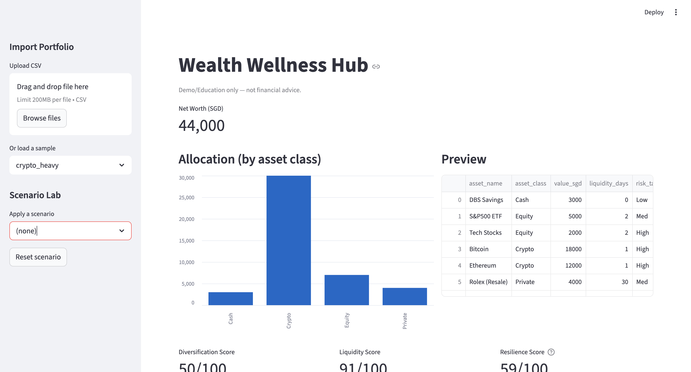
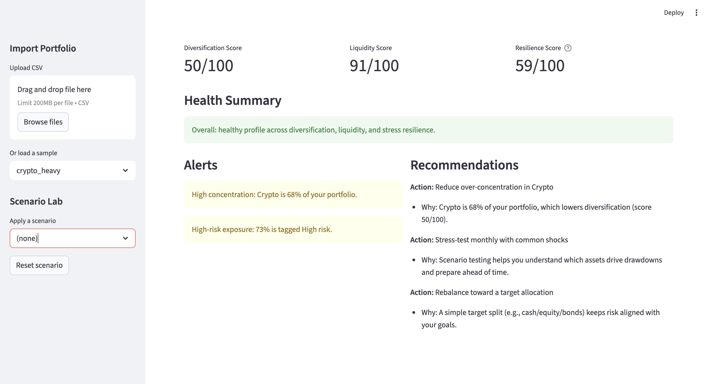
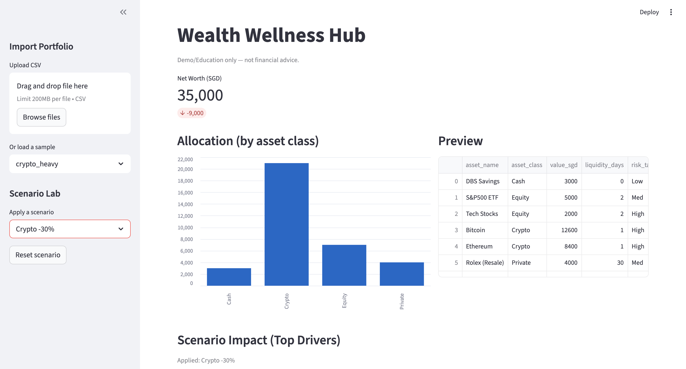
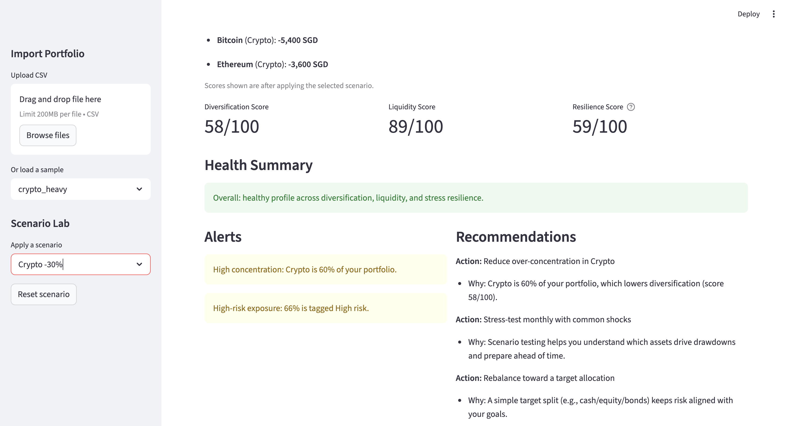
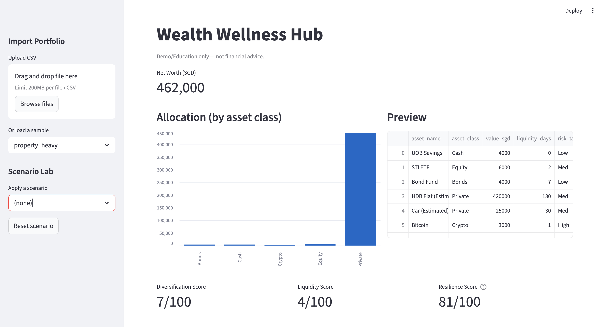
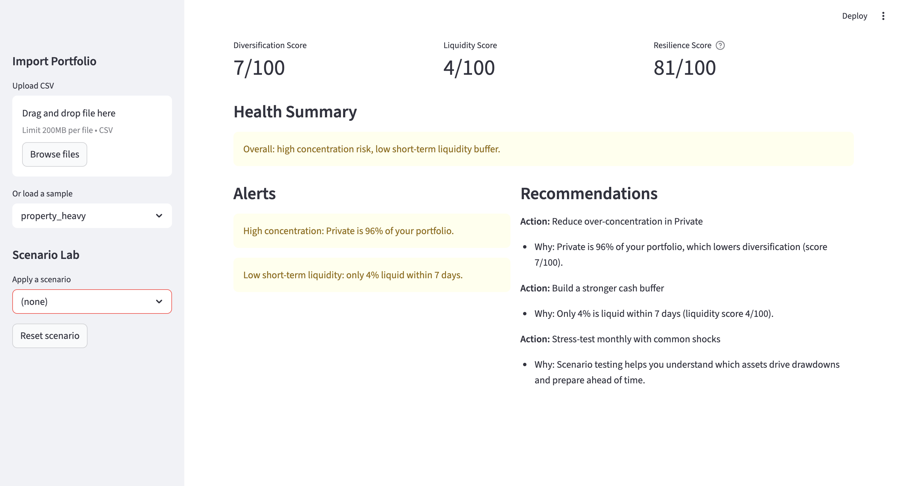

# wealth-wellness-hub

A single “Wealth Wallet” dashboard that aggregates fragmented assets (cash, equities, crypto, private assets) into one view, computes simple financial wellness analytics, runs scenario stress tests, and recommends next actions.

> Demo/Education only — not financial advice.

## What it does (MVP)
1. Import a portfolio (Upload CSV or Load Sample)
2. Show Net Worth + asset allocation
3. Compute 3 wellness scores:
   - Diversification
   - Liquidity
   - Resilience (stress-test based)
4. Run scenario shocks (one-click buttons)
5. Output 3 recommendations tied to the scores

## Demo Screenshots

**1) Baseline portfolio view (Crypto-heavy)**



**2) Scenario stress test (Crypto -30%)**



**3) Liquidity risk example (Property-heavy)**



## Demo Script (60–90s)
1. Load sample: `crypto_heavy`
2. Show Net Worth + Allocation + Scores (Diversification/Liquidity/Resilience)
3. Apply scenario: **Crypto -30%**
4. Point to **Net Worth delta** + **Top Drivers** (BTC/ETH) + updated Alerts/Recommendations
5. Switch to sample: `property_heavy`
6. Highlight **low liquidity** + recommendation to build cash buffer

## How to run
```bash
pip install -r requirements.txt
streamlit run app.py
